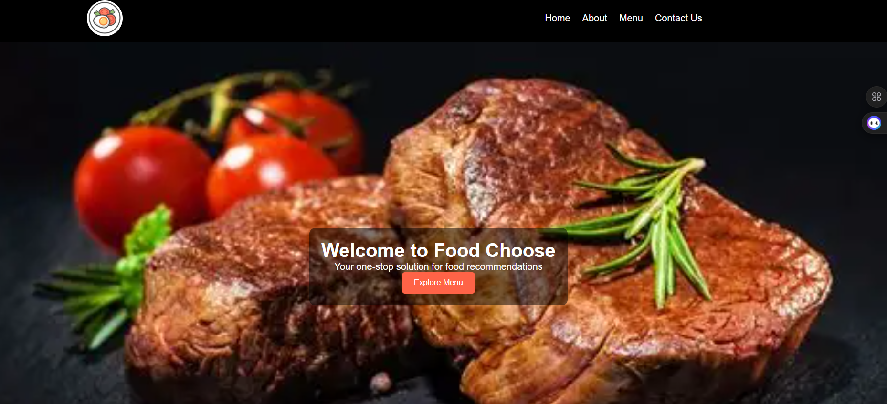
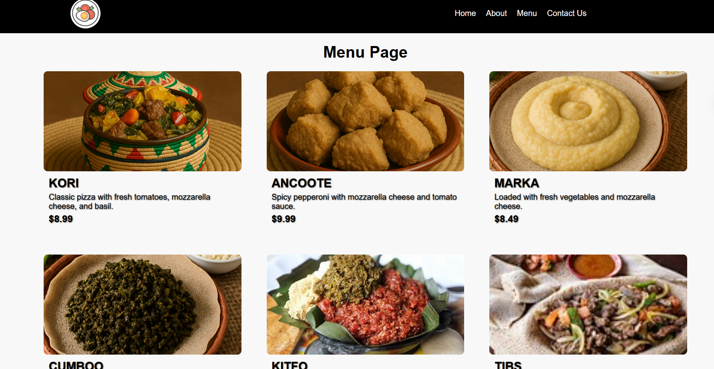
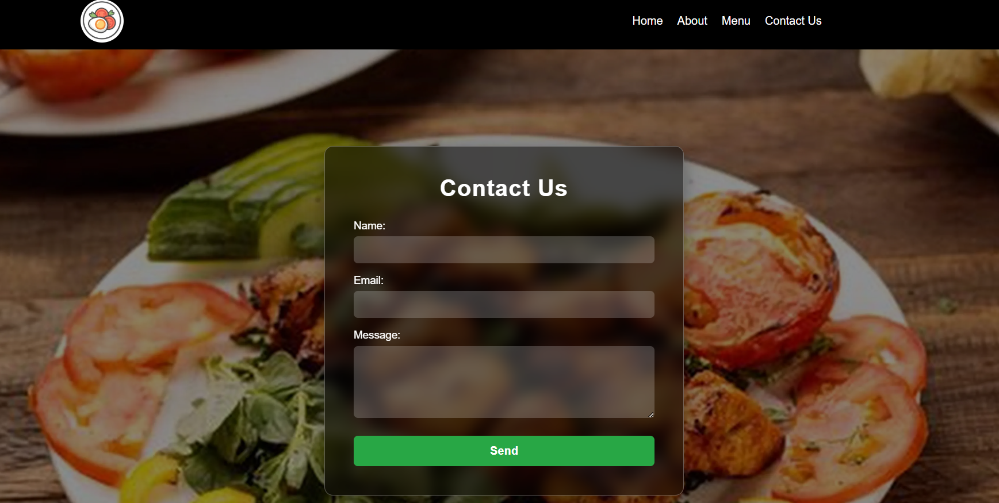

# 🍔 Oro Food Delivery

Oro Food Delivery is a simple and responsive web project for an online food delivery service.  
It provides users with an easy way to browse menus, learn about the service, and contact the business for food orders.

---

## 🚀 Features

- 🏠 **Home Page:** Introduction to Oro Food Delivery and highlights of what we offer.  
- 📜 **Menu Page:** Displays a list of delicious food items with their names and prices.  
- ℹ️ **About Page:** Information about the company and its mission.  
- 📞 **Contact Page:** Allows customers to get in touch for orders or inquiries.

---

## 🧩 Pages Overview

1. **Home Page (`index.html`)**  
   - Welcoming message and navigation bar to other pages.

2. **Menu Page (`menu.html`)**  
   - List of food items with prices and names.

3. **About Page (`about.html`)**  
   - Description of Oro Food Delivery’s story and services.

4. **Contact Page (`contact.html`)**  
   - Simple contact form or business contact details.

---

## 🧑‍💻 Technologies Used

- REACT JS 
- CSS3  
- JavaScript (optional if you add interactivity)

---

## 🖼️ Page Previews

### 🏠 Home Page  

---

### 📜 Menu Page  

---

### ℹ️ About Page  

---

### 📞 Contact Page  

---

## 📬 Contact

If you’d like to contribute or have suggestions, feel free to reach out!

**Author:** Wakj-jira  
**Email:** wakjiratesama@gmail 
**GitHub:** (https://github.com/Wakjira_Tesama)

---

⭐ *If you like this project, please give it a star on GitHub!*
